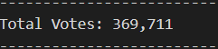
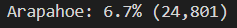
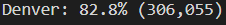
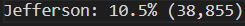
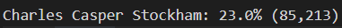
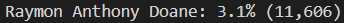
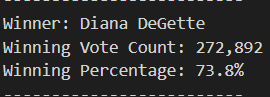

# Election_Analysis

## Project Overview
  In this challenge we are tasked with helping Seth and Tom to break down the data and complete the election audits on a recent congressional election. We will have to come up with results of the election based on the information provided to us by Tom in a CSV file. 
  
  ## Resources 
- Data Sources: election_results.csv
- software: Pythin 3.9.7, Visual studio code 1.63

## Summary
  One of the first tasks was to come up with a full count of votes that were collected out of the counties involved. All three counties had a total of 369,711 votes. 
  

  The election consisted of three diffrent counties, as we start to look at each county we will provide the vote count also the percentage of votes.
    First county is Arapahoe with 6.7% of the votes which resulted in 24,801 actual votes.
  
    Second county is Denver with 82.8% of the votes which resulted in 306,055 actual votes.
  
    Third county is Jefferson with 10.5% of the votes which resulted in 38,855 actual votes.
   

  While looking at the data we can see that Denver had the largest number of votes and the highest turnout of voters
   
  
  Next we look at the candidates who were involved in the election, we will look at each of the candidates votes and percanetage to determine who is the winner of the election

  Charles Casper Stockham had total of 85,213 votes which resulted in 10.5% of the votes counted. 
   

  Diana DeGette: had a total of 272,892 votes which resulted in 73.8% of the votes counted
   

  Raymon Anthony Doane: had total of 11,606 votes which resulted in 3.1% of the votes counted. 
   

  When we look at the completed data and complete count of votes we come to a conclusion that Diana DeGette was a winner of the election. Diana had the highest number of votes out of the three candidates. 
  

  ## Summary

